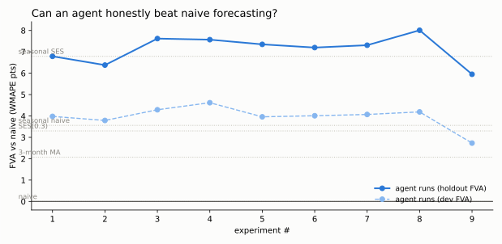

# Forecast Autoresearch — bir yapay zeka ajanı naive tahmini dürüstçe yenebilir mi?

[](https://github.com/gulmezeren2-byte/forecast-autoresearch/actions/workflows/ci.yml)  

🇬🇧 English version: [README.md](README.md)

> Yapay zeka ajanına **düzenleyebileceği tek dosya**, **asla göremeyeceği mühürlü bir test dönemi**, sabit bir deney bütçesi ve tek dürüst metrik veriliyor: **geçen ayın sayısını sevk etmeye karşı katma değer.**
> Klasik istatistiğin koyduğu çıta: **+6,79 puan.** İki döngü ve on deney sonra: **+8,13.**



**Durum — döngü 1-2 tamamlandı (10 deney; 4 ret/gerileme eksiksiz kayıtlı):** çıta önce *itidalle* düştü (kesikli talebe mevsimsel endeks dayatmayı reddederek), sonra rekor iki kez aynı meşru mekanizmayla kırıldı — **geçmiş-içi öz-ayar**: her serinin kendi düzeltme katsayısını ve penceresini değerlendirme penceresinden değil, kendi geçmişinden seçmesi. Ders kitabının kesikli-talep uzmanı (Croston/SBA) ölçüldü ve düz ortalamaya kaybetti; "dayanıklı" medyanlar sert geriledi; yalnız dev'i iyileştiren bir değişiklik ilkesel olarak reddedildi. Her koşu gerekçesiyle [skor tablosunda](leaderboard.md) ve [günlükte](journal/JOURNAL.md).

## Referans çıtası (gerçek sayılar, donmuş protokol)

| Model | Dev FVA | **Holdout FVA** |
|-------|--------:|----------------:|
| naive (geçen ay) | +0,00 | +0,00 |
| seasonal naive | −0,94 | +3,56 |
| 3 aylık hareketli ortalama | +1,38 | +2,07 |
| SES (α=0,3) | +1,20 | +3,30 |
| **seasonal SES** | **+3,98** | **+6,79** |

Daha ajan hiçbir şeye dokunmadan ilk bulgu geldi bile: seasonal naive, dev penceresinde naive'e *kaybederken* holdout'ta +3,56 ile *kazanıyor* — pencere seçimi tek başına bir model kıyasını tersine çevirebiliyor. Tek-bölmeli değerlendirmelerin gizlediği şey tam olarak bu.

## Protokol (donmuş)

- **Tek düzenlenebilir dosya.** Ajan yalnızca `model.py`'ı değiştirebilir — tek fonksiyon: `forecast_one(history) -> float`.
- **Mühürlü holdout.** Son 6 ay diske hiç yazılmıyor; `run.py` skorlama anında seed'den bellek içinde yeniden üretiyor. Ajan *dev* penceresine (eğitimin son 6 ayı) karşı iterasyon yapıyor, göremediği holdout ile yargılanıyor.
- **Tek metrik.** FVA = naive WMAPE − model WMAPE (puan). Pozitif = emek, hiçbir şey yapmamaya karşı değer kattı; [forecast-accuracy-lab](https://github.com/gulmezeren2-byte/forecast-accuracy-lab) disiplininin ajana uygulanmış hali.
- **Bütçe.** Skorlama başına 120 saniye duvar-saati — kaba kuvvet değil, zarafet.
- **Kurcalama kanıtı.** Her skor satırı protokol dosyalarının ve `model.py`'ın hash'lerini taşır. Korkuluklar prosedürel ve denetlenebilirdir (git geçmişi + hash'ler); [CLAUDE.md](CLAUDE.md) çalışma sözleşmesi holdout'u yeniden üretmeyi açıkça yasaklar.

## İş bölümünün kendisi deneydir

| Dosya | Kim düzenler | Rol |
|-------|--------------|-----|
| [`prepare.py`](prepare.py) | kimse (donmuş) | Dünya: 4 talep deseninde 24 SKU × 48 ay |
| [`model.py`](model.py) | **ajan** | Tek kol: naive'den (FVA = 0,0) başlayan tek tahmin fonksiyonu |
| [`program.md`](program.md) | **insan** | Araştırma direktifleri: kapsam, bütçe, sıra, yasaklar, durma kuralları |
| [`run.py`](run.py) | kimse (donmuş) | Hakem: skorlar, bütçeyi uygular, tabloyu ve grafiği yazar |

İnsan asla modeli yazmaz; ajan asla gündemi belirlemez. `program.md` direksiyondur — araştırmanın nasıl yönetildiğini görmek için onu okuyun.

## Kendiniz çalıştırın

```bash
git clone https://github.com/gulmezeren2-byte/forecast-autoresearch && cd forecast-autoresearch
pip install -r requirements.txt
python prepare.py           # eğitim verisini yeniden üretir (seed'li)
python run.py --reference   # referans çıtasını yeniden kurar — her seferinde aynı sayılar
python -m pytest tests/ -q  # protokol determinizm testleri
```

Kendi deney döngünüz için (insan ya da ajan): `model.py`'ı düzenleyin, sonra `python run.py --note "hipoteziniz"`.

## Bu neden var?

Herkes ajanların neyi otomatikleştirebileceğini soruyor. Bu repo, *ölçüm dürüstlüğü* serisinden daha dar ve daha zor bir soru soruyor: **kendini kandırmak protokolle imkânsız kılındığında — mühürlü holdout, naive kıyası, bütçe, günlük — bir ajan tahmine gerçekte ne kadar değer katabilir?** İki sonuç da bulgudur. Ajan +6,79'u geçerse bu belgelenmiş, yeniden üretilebilir bir yetenektir. Platoya takılırsa bu da [forecast-accuracy-lab](https://github.com/gulmezeren2-byte/forecast-accuracy-lab) ve [abc-xyz-inventory](https://github.com/gulmezeren2-byte/abc-xyz-inventory) çalışmalarının zaten savunduğu şeyin kanıtıdır: bazı talepler tahmin edilmez, tamponlanır — tahmini kim yaparsa yapsın.

## Yol haritası

- [ ] Deney döngüsü 1: klasik istatistik kapsamı (`program.md`)
- [ ] Desen-ayrımlı direktifler: lumpy SKU'lara özel kural gerekir mi?
- [ ] Tam günlükle döngü yazısı
- [ ] Döngü 2: hak ederse, daha geniş kapsam

## Hakkında

**[Eren Gülmez](https://www.linkedin.com/in/erengulmez)** tarafından tasarlandı ve yönetiliyor — endüstri mühendisi, İstanbul. *Ölçüm dürüstlüğü* serimin final deneyi: ölçüm sistemini insan tasarlar ve araştırmayı insan yönetir; denemeyi ajan yapar.

Açık endüstri mühendisliği araç setinin parçası → **[awesome-industrial-engineering](https://github.com/gulmezeren2-byte/awesome-industrial-engineering)**

## Lisans

[MIT](LICENSE)
